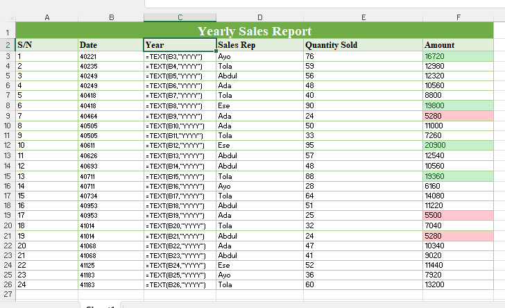
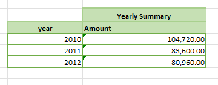

# Kabir Sales Analysis

## Executive Summary

Sales show a declining trend over the observed years (2010–2012), dropping from 104,720 in 2010 to 80,960 in 2012. This indicates that overall business performance is weakening, suggesting reduced demand or inefficiencies in sales operations.
---

## Visual Evidence

### Representative Performance

This table shows individual sales transactions including Sales Rep, Quantity Sold, and Amount. Formulas are displayed to validate calculations.

### Yearly Summary

This table aggregates total revenue per year, clearly showing the downward trend in sales.

### Additional Analysis Tables

Includes calculations such as total revenue per sales representative and transaction counts using functions like SUMIF and COUNTIF.

---

## Business Recommendations

### Efficiency

The sales representative with the highest transaction count is Tola (7 transactions), and she also generates the highest revenue (82,720).

There is no sales rep who has the highest transaction count without also having the highest revenue.

Implication:
This suggests that higher activity (more transactions) is directly translating into higher revenue. Sales efficiency is consistent, and there is no evidence of a rep making many low-value sales without impact.

### Trend Analysis

Yearly revenue shows a steady decline:

2010: 104,720
2011: 83,600
2012: 80,960

Recommendation for 2013:
The company should not hire more staff at this stage. Instead, it should focus on:

Improving sales strategies
Investigating causes of declining demand
Training existing staff to increase deal value

Reasoning:
Hiring more staff during a declining revenue trend could increase costs without guaranteeing improved performance. Stabilizing and reversing the downward trend should be the priority.
Conclusion

The business is currently experiencing a decline in sales performance, but internal efficiency among sales reps remains strong. Strategic improvements—not expansion—are recommended to restore growth.